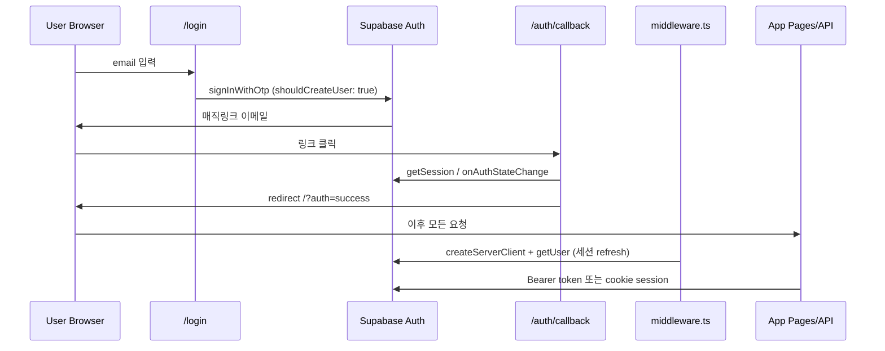

# [SYNC] 프로젝트 현황 및 보안 진단 리포트

> **분석 기준일:** 2026-06-21  
> **Canonical DB/RPC:** `DOCS/DB_SCHEMA.md`, `DOCS/RPC_SPEC.md`, `DOCS/RPC_FUNCTIONS.md` (production export, 2026-04-29)  
> **로컬 마이그레이션:** `supabase/migrations/` (001–019) — production과 **불일치 다수 확인**

---

> Note: This audit report is treated as a historical reference during Phase 1 recovery. Confirmed findings and current Production verification results are tracked in `DOCS/PROD_VERIFY_YYYYMMDD.md`.

## 1. 아키텍처 및 코어 파일 구조

### 1.1 핵심 기술 스택 및 버전

| 영역 | 기술 | 버전 (`package.json`) |
|------|------|------------------------|
| 프레임워크 | Next.js (App Router) | **16.2.1** |
| UI | React / React DOM | **19.2.4** |
| 스타일 | Tailwind CSS | **^4** |
| BaaS | `@supabase/supabase-js`, `@supabase/ssr` | **2.100.1** / **0.10.2** |
| AI 심사 | `@google/generative-ai` (Gemini) | **0.24.1** |
| 토스트 | sonner | **2.0.7** |
| 컴파일러 | babel-plugin-react-compiler | 1.0.0 (`next.config.ts`) |
| 언어 | TypeScript | **^5** |

**서버 전용 환경 변수 (코드에서 참조):**

| 변수 | 용도 | 참조 파일 |
|------|------|-----------|
| `NEXT_PUBLIC_SUPABASE_URL` | Supabase URL | `src/lib/supabase.ts`, `middleware.ts` |
| `NEXT_PUBLIC_SUPABASE_ANON_KEY` | anon 클라이언트 (RLS 적용) | 동일 |
| `SUPABASE_SERVICE_ROLE_KEY` | RLS 우회, 관리자 API, AI 백그라운드 | `src/lib/supabase-service.ts` |
| `GEMINI_API_KEY` | 활동 AI 심사 | `src/lib/ai-reviewer.ts` |
| `SOCIALDATA_API_KEY` | X 트윗 스크래핑 | `src/app/api/scraping/x/route.ts` |
| `SOCIALDATA_API_BASE_URL` | (선택) SocialData 엔드포인트 | 동일 |

---

### 1.2 디렉토리 구조 및 라우팅

```
fandom-test/
├── middleware.ts                    # Supabase 세션 refresh (라우트 보호 없음)
├── DOCS/                            # Canonical DB/RPC (production 기준)
├── supabase/migrations/             # 로컬 SQL (production과 drift)
├── src/
│   ├── app/                         # Next.js App Router 페이지 + API
│   ├── components/                  # UI, auth gate, feed, shop 등
│   ├── lib/                         # Supabase, rewards, AI, admin-auth
│   └── utils/supabase/              # SSR server/browser client
```

#### 페이지 라우트 (`src/app/**/page.tsx`)

| 경로 | 파일 | 역할 |
|------|------|------|
| `/` | `src/app/page.tsx` → `HomeClient.tsx` | 메인 피드 |
| `/login` | `src/app/login/page.tsx` | 매직링크 OTP 로그인 |
| `/auth/callback` | `src/app/auth/callback/page.tsx` | OAuth/매직링크 콜백 |
| `/write` | `src/app/write/page.tsx` | 활동 인증 작성 (`RequireAuth` + `ProfileNicknameGate`) |
| `/activities/[id]` | `src/app/activities/[id]/page.tsx` | 활동 상세, 조회수 RPC, Sync |
| `/profile` | `src/app/profile/page.tsx` | 프로필, X 연동, VIBE 표시 |
| `/leaderboard` | `src/app/leaderboard/page.tsx` | 누적 랭킹 |
| `/shop` | `src/app/shop/page.tsx` | 상점 + `purchase_item` RPC |
| `/inventory` | `src/app/inventory/page.tsx` | 인벤토리 + `toggle_item_active` RPC |
| `/settlements` | `src/app/settlements/page.tsx` | 정산 이력 |
| `/admin` | `src/app/admin/page.tsx` | 관리자 대시보드 (서버 `resolveServerAdminAccess`) |
| `/admin/activities/[id]` | `src/app/admin/activities/[id]/page.tsx` | 개별 심사 |

#### API 라우트 (`src/app/api/**/route.ts`)

| 엔드포인트 | 메서드 | 파일 | 인증 |
|------------|--------|------|------|
| `/api/activity-logs` | POST/PATCH/DELETE | `src/app/api/activity-logs/route.ts` | Bearer JWT |
| `/api/scraping/x` | POST | `src/app/api/scraping/x/route.ts` | Bearer + X verified |
| `/api/auth/x-verify` | POST | `src/app/api/auth/x-verify/route.ts` | Bearer |
| `/api/admin/pending-logs` | GET | `src/app/api/admin/pending-logs/route.ts` | Admin Bearer |
| `/api/admin/approved-logs` | GET | `src/app/api/admin/approved-logs/route.ts` | Admin Bearer |
| `/api/admin/activity-logs/[id]` | GET | `src/app/api/admin/activity-logs/[id]/route.ts` | Admin Bearer |
| `/api/admin/activity-logs/[id]/approve` | POST | `.../approve/route.ts` | Admin Bearer + service role |
| `/api/admin/activity-logs/[id]/reject` | POST | `.../reject/route.ts` | Admin Bearer + service role |
| `/api/admin/perform-weekly-settlement` | POST | `.../perform-weekly-settlement/route.ts` | Admin Bearer + service role |
| `/api/debug-supabase` | GET | `src/app/api/debug-supabase/route.ts` | dev only |
| `/api/dev/seed-test-spot` | POST | `src/app/api/dev/seed-test-spot/route.ts` | dev only |

#### Supabase 클라이언트 계층

| 함수 | 파일 | 용도 |
|------|------|------|
| `getSupabaseBrowserClient()` | `src/lib/supabase.ts` → `src/utils/supabase/client.ts` | 브라우저, `@supabase/ssr` cookie session |
| `createSupabaseAnonClient()` | `src/lib/supabase.ts` | Route Handler, anon + RLS |
| `createSupabaseServerClient()` | `src/utils/supabase/server.ts` | Server Component, cookie session |
| `createSupabaseServiceRoleClient()` | `src/lib/supabase-service.ts` | RLS 우회 (서버 전용) |

---

## 2. 데이터베이스 및 Supabase 권한 현황

### 2.1 연결된 테이블 스키마 (Canonical: `DOCS/DB_SCHEMA.md`)

**핵심 엔티티 14개:**

| 테이블 | 비즈니스 역할 |
|--------|---------------|
| `profiles` | 사용자 프로필, `total_vibes`, X 인증 필드 |
| `activity_logs` | 팬덤 활동 인증 (status, reward, view, AI 결과) |
| `activity_types` | 활동 카테고리, `base_vibes` |
| `artists` | 아티스트 메타 |
| `activity_syncs` | 활동별 Sync(공감) |
| `activity_comments` | 승인 활동 댓글 |
| `activity_view_logs` | 일 1회 qualified view 추적 |
| `settlement_history` | 주간 정산 이력 |
| `shop_items` / `user_inventory` | 상점·인벤토리 |
| `spots` | 지도 스팟 (테스트용) |

**`activity_logs` 상태 흐름 (코드 기준):**  
`pending` → (AI `analyzed` 가능) → `approved` / `rejected` / `deleted`

---

### 2.2 RLS (Row Level Security) 현황

#### 마이그레이션에 명시된 RLS (`supabase/migrations/`)

| 테이블 | RLS | 정책 파일 | 요약 |
|--------|-----|-----------|------|
| `artists` | ON | `003_activity_logs_onboarding.sql` | `SELECT` 전체 공개 |
| `activity_types` | ON | 003 | `SELECT` 전체 공개 |
| `activity_logs` | ON | 003, 007 | 본인 `INSERT/SELECT`; 승인글 `SELECT` 공개 |
| `profiles` | ON | 003, 007, 014 | 본인 CRUD; 피드/리더보드용 공개 `SELECT` |
| `activity_syncs` | ON | `008_activity_syncs_comments_views.sql` | 승인글 관련 `SELECT/INSERT/DELETE` |
| `activity_comments` | ON | 008 | 승인글 댓글 |
| `settlement_history` | ON | `010_settlement_and_is_settled.sql` | 본인 `SELECT` only |
| Storage `activity-images` | ON | `019_activity_logs_image_urls_and_storage.sql` | 본인 폴더 업로드, 공개 읽기 |

#### RLS 정책이 **로컬 마이그레이션에 없는** 테이블

- `shop_items`, `user_inventory`, `activity_view_logs`, `spots` — **CREATE/RLS SQL 없음**
- `activity_logs` **`UPDATE` 정책 없음** — 그러나 아래 클라이언트/API에서 UPDATE 다수 사용

#### 클라이언트에서 DB 직접 조작하는 위치

| 동작 | 파일 | Supabase 호출 |
|------|------|---------------|
| 피드 조회 | `src/components/home/HomeClient.tsx` | `.from("activity_logs").select(...)` |
| Sync 토글 | `src/components/activities/ActivitySyncControl.tsx` | `.from("activity_syncs").insert/delete` |
| 댓글 | `src/components/activities/ActivityCommentsSection.tsx` | `.from("activity_comments")` |
| 조회수 | `src/app/activities/[id]/page.tsx` | `.rpc("increment_view_count_v4", ...)` |
| 상점 구매 | `src/app/shop/page.tsx` | `.rpc("purchase_item")` |
| 인벤토리 적용 | `src/app/shop/page.tsx`, `inventory/page.tsx` | `.rpc("toggle_item_active")` |
| 프로필 수정 | `src/app/profile/page.tsx`, `ProfileNicknameGate.tsx`, `LanguageProvider.tsx` | `.from("profiles").update/upsert` |
| 이미지 업로드 | `src/app/write/WriteContent.tsx` | `storage.from("activity-images").upload` |
| 랭킹 | `src/app/leaderboard/page.tsx` | `.from("profiles").select(...).order("total_vibes")` |
| 정산 조회 | `src/app/settlements/page.tsx` | `activity_logs`, `activity_syncs`, `settlement_history` |

**서버 API 경유 (권장 패턴):** 활동 제출/수정/삭제 → `src/app/api/activity-logs/route.ts`  
**관리자 전용 (service role):** `src/app/api/admin/**`

---

### 2.3 RPC 권한 매트릭스

| RPC | Canonical body | 로컬 migration grant | 앱 호출 위치 |
|-----|----------------|---------------------|--------------|
| `increment_view_count_v4` | `DOCS/RPC_FUNCTIONS.md` L195–218 | **마이그레이션 없음** | `activities/[id]/page.tsx` L192 |
| `purchase_item` | migration 017 + DOCS | grant **미명시** | `shop/page.tsx` L128 |
| `toggle_item_active` | migration 017 | grant **미명시** | `shop/page.tsx`, `inventory/page.tsx` |
| `admin_approve_activity_log_v2` | DOCS L332–361 | **마이그레이션 없음** | `admin/.../approve/route.ts` L120 (service role) |
| `perform_weekly_settlement` | DOCS vs migration 013 **로직 불일치** | `service_role` only | `perform-weekly-settlement/route.ts` |
| `get_weekly_rising_leaderboard` | migration 015 | `anon, authenticated` | `src/lib/weekly-rising.ts` |
| `increment_view_count_v2` | migration 011–012 | `anon, authenticated` | **앱 미사용** (v4로 대체됨) |

---

### 2.4 사용자 인증(Auth) 및 세션 관리



| 단계 | 파일 | 구현 |
|------|------|------|
| 로그인 | `src/app/login/page.tsx` L96–102 | `supabase.auth.signInWithOtp`, redirect `/auth/callback` |
| 콜백 | `src/app/auth/callback/page.tsx` L43–66 | browser client session 확립 |
| 세션 갱신 | `middleware.ts` L13–27 | `@supabase/ssr` cookie refresh (**라우트 ACL 없음**) |
| 클라이언트 가드 | `src/components/auth/RequireAuth.tsx` | `/write` 등 client-side redirect |
| 관리자 판별 | `src/lib/admin-auth.ts` | `profiles.is_admin` (service role로 조회) |
| 관리자 페이지 | `src/app/admin/page.tsx` L5–8 | 서버 `resolveServerAdminAccess()` → deny 시 `/` redirect |
| 관리자 API | `src/app/api/admin/**` | `isAdminByAccessToken()` + Bearer |

**가입 정책:** `shouldCreateUser: true` — 이메일만으로 자동 가입 허용 (`login/page.tsx` L100).

---

## 3. 핵심 비즈니스 로직 플로우

### 3.1 팬덤 아카이빙 (활동 인증)

#### A. 직접 작성 플로우

```
/write (WriteContent.tsx)
  → POST /api/activity-logs (route.ts POST)
    → JWT 검증 (L423–433)
    → 외부 이미지 미러링 mirrorExternalActivityImages (L95–159)
    → proof_url 중복 검사 (service role, L446–519)
    → activity_logs INSERT (anon client + RLS, L522–534)
    → scheduleActivityLogAiReview (after(), L247–308)
      → evaluateActivity (ai-reviewer.ts)
      → persistAiEvaluationAiOnly (service role or authed client)
```

| 함수 | 파일 |
|------|------|
| `POST` handler | `src/app/api/activity-logs/route.ts` L374–596 |
| `mirrorExternalActivityImages` | 동일 L95–159 |
| `scheduleActivityLogAiReview` | 동일 L247–308 |
| `evaluateActivity` | `src/lib/ai-reviewer.ts` |
| `normalizeProofUrl` | `src/lib/utils/proof-url.ts` |
| UI 제출 | `src/app/write/WriteContent.tsx` L540 (`fetch("/api/activity-logs")`) |

#### B. X 트윗 Import 플로우

```
WriteContent → POST /api/scraping/x
  → is_x_verified 검사 (route.ts L268–272)
  → SocialData API로 트윗 fetch
  → 이미지 Supabase Storage 미러링
  → (선택) activity_logs INSERT with proof_url
```

| 함수 | 파일 |
|------|------|
| `POST` | `src/app/api/scraping/x/route.ts` |
| `extractTweetId`, `mirrorTweetImagesToSupabase` | 동일 |

#### C. 조회 (Feed / Detail)

| 기능 | 파일 | 로직 |
|------|------|------|
| 피드 | `HomeClient.tsx` L160 | `activity_logs` where `status=approved` |
| 상세 | `activities/[id]/page.tsx` L95 | `activity_logs` select + join |
| 조회수 증가 | `activities/[id]/page.tsx` L188–192 | `increment_view_count_v4` |
| 클라이언트 쿨다운 | `src/lib/view-logic.ts` | localStorage 30분 |

#### D. Sync / 댓글

| 기능 | 파일 |
|------|------|
| Sync insert/delete | `ActivitySyncControl.tsx` L108–122 |
| 댓글 | `ActivityCommentsSection.tsx` L125 |

#### E. 수정 / 삭제

| 기능 | API | 파일 |
|------|-----|------|
| PATCH (재심사) | `PATCH /api/activity-logs` | `route.ts` L668–814 |
| DELETE (soft) | `DELETE /api/activity-logs` | `route.ts` L598–666, `status='deleted'` |

#### F. 관리자 승인/반려

| 기능 | API | DB RPC |
|------|-----|--------|
| 승인 + VIBE 지급 | `POST .../approve` | `admin_approve_activity_log_v2(p_log_id, p_final_vibes, p_ai_evaluation)` |
| 반려 | `POST .../reject` | service role direct UPDATE |
| AI 제안값 사용 | `AdminDashboardClient.tsx` L87–98 | `suggested_vibe` from `ai_evaluation` |

---

### 3.2 보상/포인트(VIBE) 지급 흐름

**단일 통화:** `profiles.total_vibes` (앱 코드 기준)

| 단계 | 트리거 | 금액 결정 | DB 변경 | 파일 |
|------|--------|-----------|---------|------|
| 1. 승인 즉시 지급 | 관리자 Approve | `rewarded_vibe` (API body, AI 제안값 기본) | `profiles.total_vibes += p_final_vibes`, `activity_logs.total_reward_vibes` | `approve/route.ts` → RPC v2 |
| 2. 주간 정산 보너스 | 관리자 Settlement 버튼 | `Sync×5 + view_count÷10` per log | `profiles.total_vibes += bonus`, `is_settled=true` | `perform-weekly-settlement/route.ts` → RPC |
| 3. 상점 차감 | 유저 구매 | `shop_items.price` | `total_vibes -= price`, `user_inventory` INSERT | `shop/page.tsx` → `purchase_item` |
| 4. UI 추정치 | 표시용 only | `estimatedBonusVibes()` | DB 변경 없음 | `src/lib/rewards.ts` L4–8 |

**정산 공식 (앱 + DOCS production RPC):**

```typescript
// src/lib/rewards.ts
sync * 5 + Math.floor(views / 10)
```

**조작 가능성 분석:**

| 벡터 | 심각도 | 근거 |
|------|--------|------|
| `increment_view_count_v4` 무제한 `view_count` +1 | **High** | RPC body(DOCS L202–204): `status='approved'` 검사 없음, 호출마다 +1. 정산은 `view_count` 사용 |
| 클라이언트 localStorage 쿨다운 | **Med** | `view-logic.ts` — DevTools/localStorage 삭제로 우회 가능 |
| `profiles.total_vibes` 직접 UPDATE | **High (조건부)** | `profiles_update_own` RLS가 컬럼 제한 없음 → production에 column-level guard 없으면 콘솔에서 self-update 가능 |
| `purchase_item` RPC 직접 호출 | **Low** | `auth.uid()` + `FOR UPDATE` + 잔액 검사 (migration 017) |
| `admin_approve_activity_log_v2` 직접 호출 | **High (조건부)** | SECURITY DEFINER + `p_final_vibes` 임의값. grant가 `authenticated`에 열려 있으면 관리자 API 우회 가능 |
| 관리자 Approve API | **Med** | `MAX_REWARD_VIBES = 1_000_000` (`approve/route.ts` L25), base_vibes 상한 검증 없음 |

---

## 4. 보안 취약점 및 기술 부채 (Actionable Red Flags)

### **[심각도: High] | Production ↔ 로컬 마이그레이션 스키마 Drift**

- **위치:** `supabase/migrations/` vs `DOCS/DB_SCHEMA.md`, `DOCS/RPC_FUNCTIONS.md`
- **문제점:**
  - 앱은 `total_vibes`, `base_vibes`, `activity_id` 컬럼명, `increment_view_count_v4`, `admin_approve_activity_log_v2` 사용
  - 로컬 migration은 `total_points`, `base_points`, `activity_log_id`, v2 RPC, v1 approve RPC
  - `activity_view_logs` 테이블, `shop_items`/`user_inventory` CREATE, `is_admin` 컬럼 — **마이그레이션 부재**
  - `settlement_history`: migration `bonus_points` vs 앱 `bonus_vibes` (`settlement-metadata.ts`)
- **우선 조치:** production export 기준으로 `supabase/migrations` 재동기화. fresh deploy 시 앱 전면 장애 가능.

---

### **[심각도: High] | `increment_view_count_v4` 조회수 부정 증가 → 정산 어뷰징**

- **위치:** `DOCS/RPC_FUNCTIONS.md` L195–218; 호출 `src/app/activities/[id]/page.tsx` L192
- **문제점:**
  - `view_count`는 RPC **호출마다** +1 (승인 상태·작성자·rate limit 미검증)
  - `qualified_view_count`만 일 1회 제한
  - `perform_weekly_settlement`(DOCS L261–267)는 `view_count` 기반 보너스 계산
  - 클라이언트 쿨다운(`view-logic.ts`)은 우회 trivial
- **우선 조치:**
  1. v4 RPC에 `status='approved'` 및 rate limit 추가
  2. 정산은 `qualified_view_count`만 사용하도록 RPC/앱 통일
  3. RPC grant를 authenticated + 서버 proxy로 제한 검토

---

### **[심각도: High] | `activity_logs` UPDATE RLS 정책 부재 (레포 기준)**

- **위치:** `supabase/migrations/003_activity_logs_onboarding.sql` (INSERT/SELECT만); 사용처 `src/app/api/activity-logs/route.ts` PATCH/DELETE L631–742
- **문제점:** 로컬 migration에 `UPDATE` policy 없음. production에 정책이 없으면 사용자 수정/삭제 전면 실패; 있으면 레포와 불일치.
- **우선 조치:** `activity_logs_update_own` 정책을 migration에 명시 (`auth.uid() = user_id`, 허용 컬럼 제한).

---

### **[심각도: High] | `profiles.total_vibes` 클라이언트 UPDATE 가능성**

- **위치:** RLS `profiles_update_own` — `003_activity_logs_onboarding.sql` L110–113; 클라이언트 `profiles.update` — `profile/page.tsx` L155–159
- **문제점:** PostgreSQL RLS는 row 단위. `total_vibes`, `is_admin` 등 민감 컬럼 UPDATE를 막는 trigger/policy/trigger 없음(레포 기준).
- **우선 조치:**
  1. `BEFORE UPDATE` trigger로 `total_vibes` 등은 service role/RPC만 변경
  2. 또는 column-level REVOKE + SECURITY DEFINER RPC로 잔액 변경 집중

---

### **[심각도: High] | `admin_approve_activity_log_v2` RPC grant 미확인**

- **위치:** `DOCS/RPC_FUNCTIONS.md` L332–361; 호출 `approve/route.ts` L120–126
- **문제점:** SECURITY DEFINER 함수가 `authenticated`에 EXECUTE grant 되어 있으면, 임의 `p_final_vibes`로 self-approve 가능. v1은 `service_role` only (migration 006 L57–58)지만 v2 grant는 레포에 없음.
- **우선 조치:** production에서 `\df+ admin_approve_activity_log_v2` 확인 후 **`REVOKE ALL FROM PUBLIC; GRANT EXECUTE TO service_role`** 만 허용.

---

### **[심각도: Med] | `shop_items` / `user_inventory` RLS 미정의**

- **위치:** migration 017 (RPC만); 클라이언트 `shop/page.tsx` L51–54, L78–94
- **문제점:** 테이블 CREATE·RLS SQL 없음. RLS OFF 상태면 anon/authenticated가 inventory 직접 INSERT 가능.
- **우선 조치:** RLS ON + `SELECT` 공개(shop), inventory는 본인 SELECT only. 쓰기는 RPC 전용.

---

### **[심각도: Med] | `is_admin` 컬럼 문서·마이그레이션 부재**

- **위치:** `src/lib/admin-auth.ts` L11–16, L28–29; **`DOCS/DB_SCHEMA.md`에 없음**
- **문제점:** 관리자 게이트가 문서화되지 않은 컬럼에 의존. service role로만 읽지만, `profiles_update_own`으로 self-escalation 가능성(위 High 이슈와 연동).
- **우선 조치:** `is_admin boolean default false` migration 추가, UPDATE trigger로 보호, DB_SCHEMA 갱신.

---

### **[심각도: Med] | X 소유권 인증 — HTML 스크래핑 + substring 매칭**

- **위치:** `src/app/api/auth/x-verify/route.ts` L21–71, L124–125
- **문제점:**
  - X HTML fetch (403/429 빈번, `fetchXProfileHtml`)
  - `profileHtml.includes(verification_code)` — false positive 가능
  - X 차단 시 인증 불가
- **우선 조치:** OAuth 2.0 PKCE 또는 공식 X API로 전환.

---

### **[심각도: Med] | 관리자 승인 시 AI `suggested_vibe` 원클릭 지급**

- **위치:** `AdminDashboardClient.tsx` L87–98; `approve/route.ts` L113
- **문제점:** 관리자가 금액 검토 없이 Approve 클릭 시 AI 제안값이 그대로 `p_final_vibes`로 전달. 상한 100만 V (`MAX_REWARD_VIBES`).
- **우선 조치:** UI에서 금액 확인/수정 단계 필수화, RPC에서 `activity_types.base_vibes` 대비 합리적 상한 검증.

---

### **[심각도: Med] | Middleware가 라우트 보호하지 않음**

- **위치:** `middleware.ts` — `getUser()` only, redirect 없음
- **문제점:** `/admin`, `/write`, `/settlements` 등은 client/server 개별 가드에 의존. API는 Bearer 검증하지만 페이지 직접 접근 시 flash of content 가능.
- **우선 조치:** middleware matcher에 `/admin/**` deny, `/write` auth redirect 추가.

---

### **[심각도: Med] | `perform_weekly_settlement` 이중 구현**

- **위치:** `supabase/migrations/013_perform_weekly_settlement.sql` vs `DOCS/RPC_FUNCTIONS.md` L251–284
- **문제점:** migration은 `bonus_points`/`total_points`/per-log week; DOCS는 `bonus_vibes`/`total_vibes`/user aggregate. 앱은 DOCS 쪽 컬럼명 사용.
- **우선 조치:** production RPC 단일 canonical 확정 후 migration·DOCS·앱 일치.

---

### **[심각도: Low] | Dev/Debug 엔드포인트 NODE_ENV 게이트만**

- **위치:** `src/app/api/debug-supabase/route.ts` L9; `src/app/api/dev/seed-test-spot/route.ts` L11
- **문제점:** staging에서 NODE_ENV=production이 아니면 노출. seed는 anon으로 `spots` INSERT 시도.
- **우선 조치:** 배포 환경에서 라우트 제거 또는 secret header + auth.

---

### **[심각도: Low] | `DevNav` 관리자 링크 전역 노출**

- **위치:** `src/components/dev/DevNav.tsx` L6; `src/app/layout.tsx` L39
- **문제점:** 모든 사용자에게 `/admin` 링크 표시 (서버 redirect는 동작).
- **우선 조치:** production layout에서 DevNav 제거 또는 admin-only 렌더.

---

### **[심각도: Low] | AI 심사 백그라운드 — service role fallback**

- **위치:** `activity-logs/route.ts` L281–286 (`scheduleActivityLogAiReview`)
- **문제점:** service role로 `activity_logs` AI 필드 UPDATE — RLS 우회. 정상 패턴이나 service role key 유출 시 전 테이블 쓰기 가능.
- **우선 조치:** key rotation 정책, Vercel env 접근 제한, dedicated DB role with minimal grants.

---

## 부록: 인수인계 체크리스트 (우선순위)

1. **Production Supabase**에서 RPC EXECUTE grant, RLS policy, `is_admin` 컬럼 실태 export → `DOCS/` + `supabase/migrations` 동기화
2. **`increment_view_count_v4`** 정산 연동 보안 패치 (qualified view 분리)
3. **`profiles` UPDATE trigger** — `total_vibes`, `is_admin` 보호
4. **`admin_approve_activity_log_v2`** — service_role exclusive grant 확인
5. **`shop_items` / `user_inventory`** RLS 추가
6. middleware `/admin` 보호, production DevNav 제거

---

**Canonical 참조 우선순위 (`.cursorrules` 준수):**  
코드 수정 시 `DOCS/DB_SCHEMA.md` 컬럼명, `DOCS/RPC_SPEC.md` RPC 매개변수명을 100% 일치시킬 것. 레포 migration과 DOCS가 충돌하면 **production DB를 진실 원천(source of truth)**으로 취급하고 migration을 맞출 것.